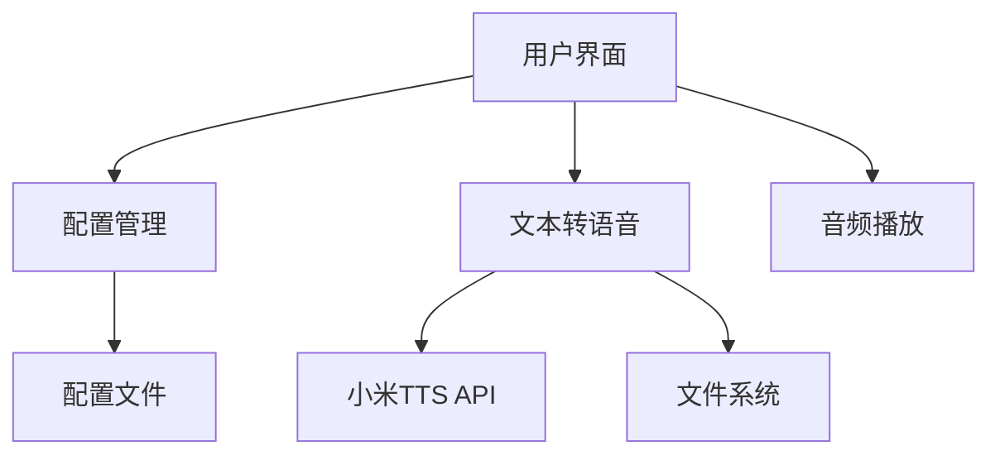

# SpeakEasy 项目代码维基

## 1. 项目概述

SpeakEasy 是一个基于 Rust 开发的 TTS（文本转语音）桌面应用程序，使用小米 TTS API 实现高质量的语音合成。

### 主要功能特性

- **文本转语音**：支持单文本和批量模式转换
- **多音色选择**：提供 mimo_default、default_zh、default_en 等预置音色
- **风格控制**：支持通过 `<style>` 标签控制语音风格（情绪、方言、角色扮演等）
- **细粒度控制**：通过音频标签精准调节语气、情绪、语速等
- **内置播放**：生成后可直接播放试听
- **配置管理**：首次运行引导配置，支持界面修改
- **时间戳命名**：自动以时间戳命名生成的文件

## 2. 目录结构

```
├── installer/           # 安装程序相关文件
│   └── SpeakEasy-Setup.exe  # Windows 安装包
├── src/                 # 源代码目录
│   ├── config.rs        # 配置管理模块
│   ├── gui.rs           # 用户界面模块
│   ├── main.rs          # 主入口文件
│   ├── player.rs        # 音频播放模块
│   └── tts.rs           # 文本转语音核心模块
├── .env.example         # 环境变量示例
├── .gitignore           # Git 忽略文件
├── Cargo.toml           # Rust 项目配置文件
├── LICENSE              # 许可证文件
├── README.md            # 项目说明文档
├── build.rs             # 构建脚本
├── icon.ico             # 应用图标
├── installer.iss        # Inno Setup 安装脚本
└── 项目架构深度解析.md    # 项目架构分析文档
```

## 3. 系统架构

SpeakEasy 采用模块化设计，主要由以下核心模块组成：



### 模块职责

| 模块 | 主要职责 | 文件位置 | 依赖关系 |
|------|---------|---------|---------|
| 主入口 | 应用初始化、窗口创建 | [main.rs](file:///workspace/src/main.rs) | eframe, egui |
| 配置管理 | 配置加载、保存、默认值 | [config.rs](file:///workspace/src/config.rs) | serde, dirs |
| 文本转语音 | 调用TTS API、处理响应 | [tts.rs](file:///workspace/src/tts.rs) | reqwest, tokio |
| 音频播放 | 音频文件播放控制 | [player.rs](file:///workspace/src/player.rs) | rodio |
| 用户界面 | 交互界面、事件处理 | [gui.rs](file:///workspace/src/gui.rs) | eframe, egui |

## 4. 核心模块

### 4.1 主入口模块 (main.rs)

主入口模块负责应用的初始化、窗口创建和主题设置。

**主要功能**：
- 加载应用图标
- 配置窗口参数
- 初始化 GUI 应用
- 设置主题和字体

### 4.2 配置管理模块 (config.rs)

配置管理模块负责应用配置的加载、保存和默认值设置。

**主要功能**：
- 定义配置结构
- 加载配置文件
- 保存配置更改
- 处理环境变量覆盖
- 确保输出目录存在

### 4.3 文本转语音模块 (tts.rs)

文本转语音模块是应用的核心，负责与小米 TTS API 交互，实现文本到语音的转换。

**主要功能**：
- 构建 TTS 请求
- 调用小米 TTS API
- 处理 API 响应
- 解码音频数据
- 生成输出文件名
- 保存音频文件

### 4.4 音频播放模块 (player.rs)

音频播放模块负责音频文件的播放控制。

**主要功能**：
- 初始化音频流
- 播放音频文件
- 停止播放

### 4.5 用户界面模块 (gui.rs)

用户界面模块负责应用的交互界面和事件处理。

**主要功能**：
- 渲染主界面
- 处理用户输入
- 管理配置界面
- 显示状态消息
- 管理生成的文件列表
- 处理批量转换

## 5. 关键类与函数

### 5.1 主入口模块

| 函数名 | 功能描述 | 参数 | 返回值 |
|--------|---------|------|--------|
| `main()` | 应用主入口 | 无 | `eframe::Result<()>` |
| `load_icon()` | 加载应用图标 | 无 | `egui::IconData` |
| `load_icon_from_bytes()` | 从字节加载图标 | `bytes: &[u8]` | `Result<egui::IconData, Box<dyn std::error::Error>>` |
| `setup_light_theme()` | 设置浅色主题 | `ctx: &egui::Context` | 无 |
| `setup_custom_fonts()` | 设置自定义字体 | `ctx: &egui::Context` | 无 |

### 5.2 配置管理模块

| 类/函数名 | 功能描述 | 参数 | 返回值 |
|-----------|---------|------|--------|
| `Config` | 配置结构 | 无 | 无 |
| `Config::default()` | 创建默认配置 | 无 | `Config` |
| `Config::config_path()` | 获取配置文件路径 | 无 | `PathBuf` |
| `Config::load()` | 加载配置 | 无 | `Config` |
| `Config::save()` | 保存配置 | 无 | `Result<()>` |
| `Config::ensure_output_dir()` | 确保输出目录存在 | 无 | `Result<()>` |

### 5.3 文本转语音模块

| 类/函数名 | 功能描述 | 参数 | 返回值 |
|-----------|---------|------|--------|
| `TtsClient` | TTS 客户端 | 无 | 无 |
| `TtsClient::new()` | 创建 TTS 客户端 | `api_key: String, api_base: String, model: String` | `TtsClient` |
| `TtsClient::synthesize()` | 合成语音 | `text: &str, voice: &str` | `Result<Vec<u8>>` |
| `TtsClient::synthesize_to_file()` | 合成语音并保存到文件 | `text: &str, voice: &str, output_path: &PathBuf` | `Result<()>` |
| `get_available_voices()` | 获取可用音色列表 | 无 | `Vec<&'static str>` |
| `generate_output_filename()` | 生成输出文件名 | `extension: &str` | `String` |
| `generate_output_filename_with_index()` | 生成带索引的输出文件名 | `extension: &str, index: usize` | `String` |

### 5.4 音频播放模块

| 类/函数名 | 功能描述 | 参数 | 返回值 |
|-----------|---------|------|--------|
| `AudioPlayer` | 音频播放器 | 无 | 无 |
| `AudioPlayer::new()` | 创建音频播放器 | 无 | `AudioPlayer` |
| `AudioPlayer::play()` | 播放音频文件 | `path: &PathBuf` | `Result<()>` |
| `AudioPlayer::stop()` | 停止播放 | 无 | 无 |

### 5.5 用户界面模块

| 类/函数名 | 功能描述 | 参数 | 返回值 |
|-----------|---------|------|--------|
| `TtsApp` | 应用主类 | 无 | 无 |
| `TtsApp::new()` | 创建应用实例 | `_cc: &eframe::CreationContext<'_>` | `TtsApp` |
| `TtsApp::save_config()` | 保存配置 | 无 | 无 |
| `TtsApp::start_synthesis()` | 开始语音合成 | `text: String, index: Option<usize>` | 无 |
| `TtsApp::check_task_result()` | 检查任务结果 | 无 | 无 |
| `TtsApp::play_selected()` | 播放选中的文件 | 无 | 无 |
| `TtsApp::open_output_folder()` | 打开输出文件夹 | 无 | 无 |
| `TtsApp::update()` | 更新应用界面 | `ctx: &egui::Context, _frame: &mut eframe::Frame` | 无 |

## 6. 依赖关系

| 依赖库 | 版本 | 功能描述 | 用途 |
|--------|------|---------|------|
| eframe | 0.27 | 跨平台 GUI 框架 | 应用窗口和界面 |
| egui | 0.27 | 即时模式 GUI 库 | 界面元素和交互 |
| reqwest | 0.11 | HTTP 客户端 | 调用 TTS API |
| tokio | 1 | 异步运行时 | 异步操作支持 |
| serde | 1 | 序列化/反序列化 | 配置文件处理 |
| serde_json | 1 | JSON 处理 | 配置文件和 API 响应 |
| dotenv | 0.15 | 环境变量加载 | 从 .env 文件加载配置 |
| chrono | 0.4 | 时间处理 | 生成时间戳文件名 |
| rodio | 0.17 | 音频播放库 | 播放生成的音频 |
| anyhow | 1 | 错误处理 | 统一错误处理 |
| dirs | 5 | 目录路径处理 | 配置文件和输出目录 |
| rfd | 0.13 | 文件对话框 | 选择输出目录 |
| open | 5 | 打开文件/目录 | 打开输出文件夹 |
| base64 | 0.22 | Base64 编码/解码 | 解码 API 返回的音频数据 |
| image | 0.24 | 图像处理 | 加载应用图标 |
| winres | 0.1 | Windows 资源 | 构建 Windows 可执行文件 |

## 7. 配置管理

### 7.1 配置文件位置

| 操作系统 | 配置文件路径 |
|----------|------------|
| Windows | `%APPDATA%\tts_tool\config.json` |
| macOS | `~/Library/Application Support/tts_tool/config.json` |
| Linux | `~/.config/tts_tool/config.json` |

### 7.2 配置项

| 配置项 | 说明 | 默认值 |
|--------|------|--------|
| `api_key` | 小米 TTS API 密钥 | 空字符串 |
| `api_base` | API 服务地址 | `https://api.xiaomimimo.com/v1` |
| `model` | TTS 模型 | `mimo-v2-tts` |
| `output_dir` | 音频文件保存位置 | 文档/tts_output |
| `default_voice` | 默认音色 | `default_zh` |

### 7.3 环境变量

应用支持通过环境变量覆盖配置：

| 环境变量 | 对应配置项 |
|----------|------------|
| `TTS_API_KEY` | `api_key` |
| `TTS_BASE_URL` | `api_base` |
| `TTS_MODEL` | `model` |

## 8. 运行方式

### 8.1 从源码构建

```bash
# 克隆仓库
git clone https://github.com/qq296565302/tts-rust.git
cd tts-rust

# 构建
cargo build --release

# 运行
cargo run --release
```

### 8.2 使用安装包

前往 [Releases](https://github.com/qq296565302/tts-rust/releases) 页面下载最新安装包，然后按照安装向导进行安装。

### 8.3 首次运行

首次运行时，应用会弹出配置向导，要求用户输入 API 密钥等配置信息。

## 9. 功能特性

### 9.1 文本转语音

支持两种模式：
- **单文本模式**：转换单个文本为语音
- **批量模式**：批量转换多行文本为语音，每行生成一个音频文件

### 9.2 语音风格控制

#### 整体风格控制

使用 `<style>` 标签控制语音整体风格：

```
<style>开心</style>明天就是周五了，真开心！
<style>东北话</style>哎呀妈呀，这天儿也忒冷了吧！
<style>粤语</style>呢个真係好正啊！
```

#### 细粒度控制

使用音频标签进行细粒度控制：

```
（紧张，深呼吸）呼……冷静，冷静。不就是一个面试吗……
（极其疲惫，有气无力）师傅……到地方了叫我一声……
```

### 9.3 音频播放

生成音频后，可以直接在应用中播放试听，支持播放控制。

### 9.4 配置管理

应用提供了图形化的配置界面，可以随时修改 API 密钥、API 端点、模型名称、输出目录和默认音色等配置。

## 10. 技术栈

| 技术 | 描述 | 用途 |
|------|------|------|
| Rust | 系统编程语言 | 应用开发 |
| eframe/egui | 即时模式 GUI 框架 | 用户界面 |
| 小米 TTS API | 语音合成服务 | 核心功能 |
| rodio | 音频播放库 | 音频播放 |
| reqwest | HTTP 客户端 | API 调用 |
| tokio | 异步运行时 | 异步操作 |

## 11. 项目构建

### 11.1 构建配置

项目使用 Cargo 进行构建，配置位于 [Cargo.toml](file:///workspace/Cargo.toml) 文件中。

### 11.2 发布构建

发布构建时，项目使用以下优化选项：
- 优化级别：z（最高优化）
- 链接时优化：启用
- 代码生成单元：1
-  panic 处理：abort
- 符号表：strip

### 11.3 安装包构建

项目使用 Inno Setup 构建 Windows 安装包，配置文件为 [installer.iss](file:///workspace/installer.iss)。

## 12. 许可证

本项目采用 [CC BY-NC 4.0](LICENSE) 协议开源。

- ✅ 个人学习、研究、非商业用途：免费使用
- ❌ 商业用途：需联系作者获取授权

## 13. 作者

赵世俊

## 14. 项目仓库

- GitHub: https://github.com/qq296565302/tts-rust
- Gitee: https://gitee.com/zach2019/tts-rust
